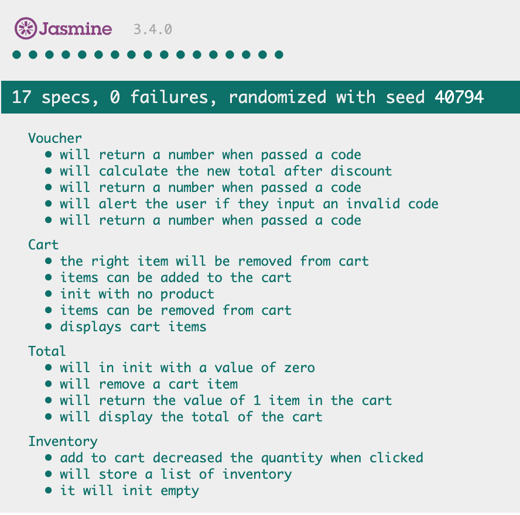

Retail Therapy Exemplar
=======================
A simple responsive web application for a clothing retailer that allows the customers to add and remove items from their shopping cart

User Stories 
============
```
As a User I can view the products and their category, price and availability information
 
As a User I can add a product to my shopping cart

As a User I can remove a product from my shopping cart

As a User I can view the total price for the products in my shopping
cart

As a User I can apply a voucher to my shopping cart

As a User I can view the total price for the products in my shopping cart
with discounts applied

As a User I am alerted when I apply an invalid voucher to my shopping
cart

As a User I am unable to Out of Stock products to the shopping cart
```

Requirements 
===========


QuickStart 
==========
```
* git clone https://github.com/CazaBelle/retail-therapy-js.git
* cd retail-therapy-js
* open SpecRunner.html # Run the tests
* open index.html` # interactive with app

```

Built with
===========
|  Tech|  Decription |   
|---|---|
|[JavaScript](https://devdocs.io/javascript/)| Language|
|[HTML](https://developer.mozilla.org/en-US/docs/Web/HTML) | Language |
|[Bootstrap](https://getbootstrap.com/)  | Web App Framework  |  
|[Jasmine](https://jasmine.github.io/)  | Testing framework  |  


Testing
========
- I followed a strict TDD cycle with this application
- All edge cases have been take into consideration


Demo
======
![]

Approach

Original Specifications
========================
You’ve been asked to develop a responsive website for a clothing retailer.
The retailer sells six different categories of clothes:
1. women’s footwear
2. men’s footwear
3. women’s casualwear
4. men’s casualwear
5. women’s formalwear and
6. men’s formalwear.
The page that you develop should display all of the available products, as well as a shopping cart to which they can be added.
The products available are:


