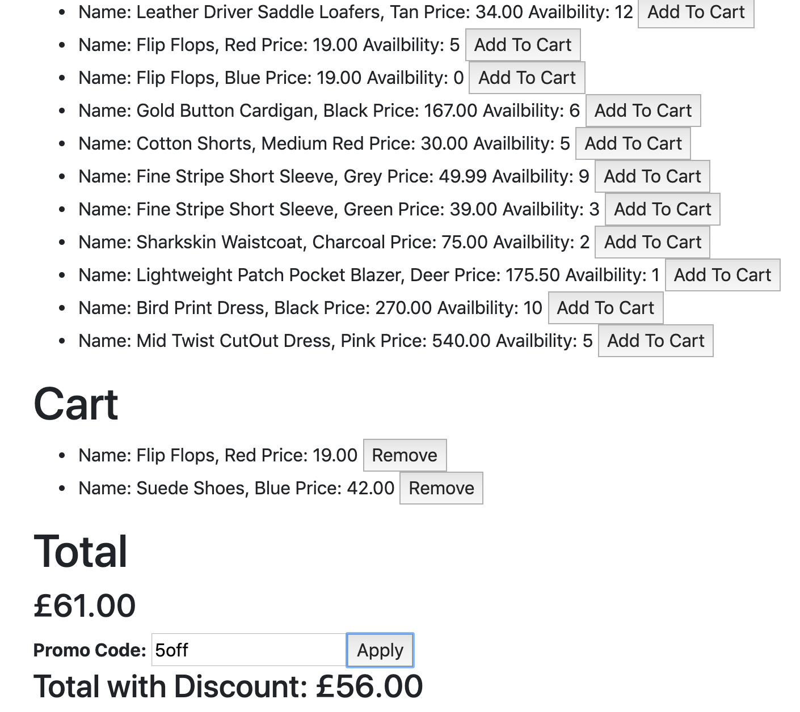
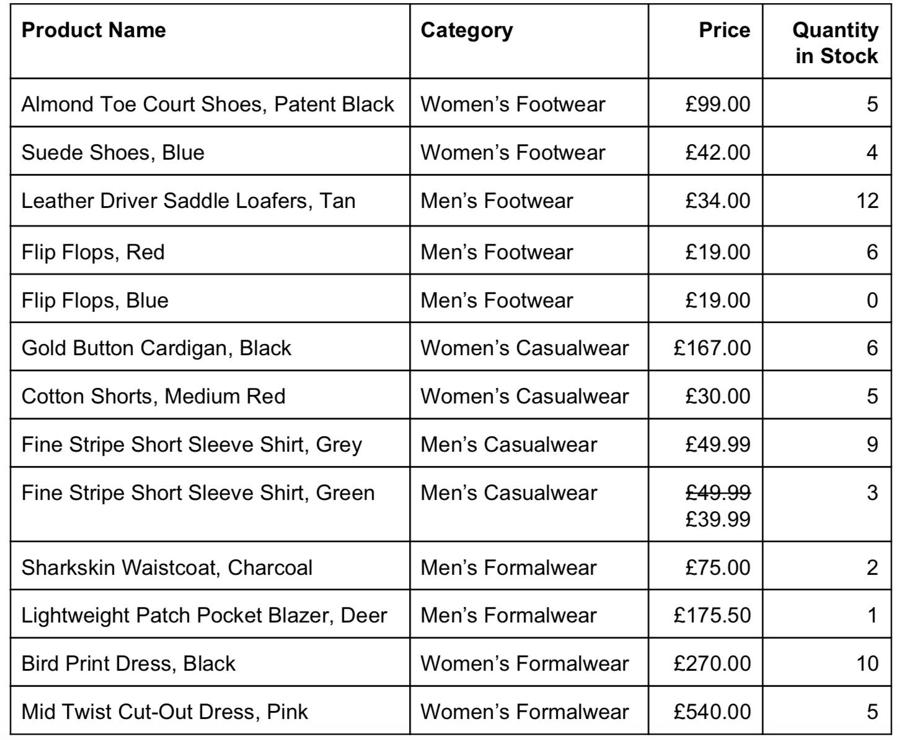

Retail Therapy Exemplar
=======================
A simple responsive web application for a clothing retailer that allows the customers to add and remove items from their shopping cart and gives an alert if an invalid promo code has been inputed.

User Stories 
============
```
As a User I can view the products and their category, price and availability information
 
As a User I can add a product to my shopping cart

As a User I can remove a product from my shopping cart

As a User I can view the total price for the products in my shopping
cart

As a User I can apply a voucher to my shopping cart

As a User I can view the total price for the products in my shopping cart
with discounts applied

As a User I am alerted when I apply an invalid voucher to my shopping
cart

As a User I am unable to Out of Stock products to the shopping cart
```

QuickStart 
==========
```
$ git clone https://github.com/CazaBelle/retail-therapy-js.git
$ cd retail-therapy-js
$ open SpecRunner.html # Runs the tests
$ open index.html` # Runs the development environement in Chrome

```

Built with
===========
|  Tech|  Decription |   
|---|---|
|[JavaScript](https://devdocs.io/javascript/)| Language|
|[HTML](https://developer.mozilla.org/en-US/docs/Web/HTML) | Language |
|[Bootstrap](https://getbootstrap.com/)  | Web App Framework  |  
|[Jasmine](https://jasmine.github.io/)  | Testing framework  |  


Testing
========
- I followed a strict TDD cycle with this application
- All edge cases have been take into consideration: 


How to Use 
==========
```
1. $ open index.html # Runs developement environement in chrome
2. Add items to your cart to see the total owed 
3. The promo codes that are accepted: 5off, 10off50, 15off75foot
```

Demo
======


Approach
========
1. I focused on the maintainability, scalability and flexibility of the code with this application 
2. Each component of the application is separated into classes to ensure Single Responsibility - each class has only one reason to change and is decoupled from the other classes. For example, Inventory is solely responsible for storing the products and creating the text that will be added to the DOM when called on by the interface. It does this independently of Cart, Total or Voucher. 
3. The functions within each class are responsible for one distinct behaviourial change. For example, within the Cart model the add() function calculates the total in the cart while the displayTotal() returns the DOM elements to be displayed with that total. 
4. The application follows the Open/Closed Principle as the available products are loaded dynamically from a file that is stored locally. As a result, It would be easy to change the inventory. 
5. With more time my next steps would have been to prevent items that are out of stock being added to the basket. The way I would approach this would to add a conditional that checks the quantity available for the item by changing the button to be 'out of stock' instead of 'add to cart'

Extensions
==========
* Improve styling
* Add navbar to separate the products page from the cart
* Add linter, CI and then deploy on surge

Original Specifications
========================
You’ve been asked to develop a responsive website for a clothing retailer.
The retailer sells six different categories of clothes:

1. Women’s footwear
2. Men’s footwear
3. Women’s casualwear
4. Men’s casualwear
5. Women’s formalwear
6. Men’s formalwear.

The page that you develop should display all of the available products, as well as a shopping cart to which they can be added.

The products available are:


There are also discount vouchers available that can be redeemed. The discount vouchers are as follows:
* £5.00 off your order
* £10.00 off when you spend over £50.00
* £15.00 off when you have bought at least one footwear item and spent over £75.00
